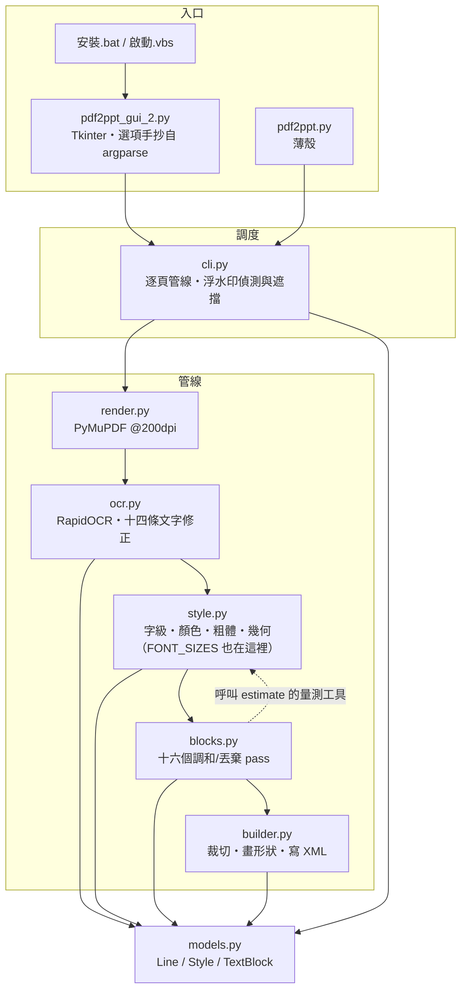

# 架構導讀：模組之間怎麼接

> ⚠️ **不知道從哪裡讀起、要動到跨模組的東西，或要新增／拆分模組之前請先讀這一份。** 十分鐘看完。
>
> **這一份只回答「模組之間怎麼接」**——依賴方向、真實呼叫順序、每個檔案裝什麼。**規則本身、門檻與反例一律不在這裡**，在 `docs/spec/`（13 章）；「規格第 N 章對到哪個檔」在 `docs/spec/12-附錄-現行實作對照.md`。
>
> ⚠️ **這一份是照程式碼現況寫的，會被改碼弄過時**（那正是它住在 `docs/dev/` 而不是 `docs/spec/` 的原因）。**不要在這裡複述規則**——複述一次就是多一份會漂的副本，這個 repo 已經吃過虧（`CJK_INK_RATIO` 漂了兩個多月；這份文件自己也曾把 `FONT_SIZES` 畫在 `models.py`，實際在 `style.py`，2026-08-24 才發現）。

## 1. 模組地圖



**依賴方向：`cli` → 管線 → `models`，不回頭。** 兩條刻意的邊，兩條都有理由：

- **`blocks` import `style`**（`_measure_em`／`snap_font_size`／`text_width_em`）：調和 pass 要重算「這個字級放不放得下」，而**寬度量測只能有一份**——`style` 是唯一知道 YaHei 度量的人。反向不成立。
- **`builder` 不 import `style`**：它只吃 `Style` 的欄位。⚠️ 這條邊正是「裁切必須寫 `Style.cover_band_px` 而不是改字墨界」的原因——`builder` 之後會把色帶重新推導一次，改字墨界等於把剛買到的間隙又還回去。

同一張 200dpi 渲染圖**同時供 OCR、樣式估計與投影片背景使用**，全程不重繪。

## 2. 真實的呼叫順序（`cli.main`）

```
render_page（PyMuPDF @200dpi）
  → OcrEngine.read（RapidOCR + 十四條文字修正）
  → estimate_style（逐行；style.py）
  → is_watermark / watermark_wipe   ← 浮水印在這裡就從 lines 拿掉
  → drop_unreproducible → drop_illegible_lines
  → merge_row_title_fragments
  → harmonize_stacked_overlap_size     ← 必須在 harmonize_font_sizes 之前
  → harmonize_font_sizes               ← 字級先調和，粗體隊列才乾淨
  → harmonize_code_block_latin
  → sync_clamped_twins
  → propagate_column_clamp → propagate_row_clamp
  → reeval_clamped_bold → harmonize_bold      （bold_mode == auto 才跑）
  → harmonize_across_dropped
  → clamp_row_neighbors
  → harmonize_chip_bg
  → lines_to_blocks → DeckBuilder.add_slide
```

`add_slide` 內部再跑 `_trim_row_overlaps` → `_trim_stacked_overlaps`，才開始畫形狀。

⚠️ **順序本身就是契約**，三條硬順序與各自的理由見 `docs/spec/02-領域模型與資料契約.md` §2.6。**那裡是正典，這裡只是實際的函式名**——兩邊不一致時以程式碼為準，並把這裡改對。

## 3. 每個模組裝什麼

**規則、門檻與反例都不在這一節。** 這裡只說「要找某件事，該打開哪個檔」。

| 模組 | 裝什麼 | 規則在哪 |
| --- | --- | --- |
| `render.py` | PyMuPDF @200dpi 渲染，一頁一張圖 | §2.1 |
| `ocr.py` | RapidOCR 呼叫，加上十四條文字修正：**模型丟掉的**（空格、表格 `\|`、行尾標點、行首圓點）、**模型讀錯的**（簡體混入、頁面詞彙校正、混淆雙字組、圖示誤認字母）、**偵測器漏掉／看錯的**（漏行救援、旋轉救援、單一字形的角度丟棄） | §3 |
| `style.py` | 逐行估一個 `Style`。四件互相糾纏的事：**字級**（字墨帶量測、逐字 CJK 共識）、**寬度夾制**（三級天花板）、**顏色**（環帶／光暈／聚類三層）、**粗體**（三段判別）。全專案最大的模組，也是字級階梯與寬度量測的家 | §4、§5、§6 |
| `blocks.py` | `estimate_style` 是**逐行**的，看不到「這兩行其實是同一段」。十六個 pass 補上這一層：丟棄、合併碎片、字級一致（八個）、粗體一致（兩個）、底色一致（一個） | §4、§5、§6、§7 |
| `builder.py` | 每個 `TextBlock` 畫成一到多個形狀；兩道裁切在畫形狀之前跑；東亞字型要自己注入 XML | §6、§8 |
| `models.py` | `Line`／`Style`／`TextBlock` 與對齊常數。**沒有邏輯** | §2 |
| `brand.py` | 這支程式的**身分**（名字、用途那句話、工作列身分、資料夾名、環境變數前綴）。它**坐在 GUI 的啟動路徑上**，所以一行 import 都沒有（多一個相依，「雙擊到視窗出現」就多付一次）。它是**複製去做下一支 AP 時唯一必須改的那支**，而且它整個模組就是共用包的注入點（`pdf2ppt/__init__.py` 的 `winkit.bind()`），見 §4 | §9.3 |
| `__init__.py` | 只有一件事：`winkit.bind(brand, package_dir=…, repo_root=…)`。放在這裡是因為**任何子模組被 import 都會先經過它**，所以「忘了 bind」不會發生在正常的執行路徑上 | §4 |
| `cli.py` | 逐頁調度（`_convert_page` 一頁一個 try，失敗只降級那一頁）、命令列參數（正典）、浮水印偵測與遮擋 | §2.6、§7、§9.5 |

**`blocks.py` 的三個共用述詞**（值得知道，因為它們是「八份手抄收斂成一份」的結果）：`_same_surface`（同粗體／文字色／底色）、`_vert_adjacent`（垂直緊鄰）、`_union_groups`（傳遞閉包）。折行分組由 `_wrap_partition` **在任何 mutation 之前算一次**——邊算邊改會讓結果取決於走訪順序。

## 4. 共用層：哪些東西該搬出去，哪些不該

三個姊妹專案（本專案、`C:\SOURCE5\Python\MP4-2-SRT`、`C:\SOURCE5\Python\meeting-scribe`）共用色票、形狀、文件規範與一批底層工具，而它們已經漂開過。**漂開的成因不是「忘了同步」，是把兩種不同性質的東西寫在同一個檔案裡。**

### 判準：這個專案需要跟別的專案長得不一樣嗎？

| | A 類：下游**必須**改 | B 類：下游**不該**改 |
| --- | --- | --- |
| 例子 | `brand.py` 的六個身分值、版面尺規、圖示畫什麼、`SKIN_SWAPS`（哪顆鈕配哪張皮）、要產哪幾張皮 | 路徑、色票、Windows API 的呼叫法（DPI、工作列的 vtable、深色標題列）、`.vbs` 骨架、捷徑的 COM、皮膚產生器的幾何（超橢圓取樣、九宮格、`pill()`）、皮膚四來源的載入器、紀錄檔 |
| 每個專案應該長得 | 不一樣（那是它的身分） | 一模一樣（一模一樣才對） |
| 機制 | **複製過去，複製完就是它自己的，不同步** | **唯一真值，改一次全部拿到** |

### A 類要再分三層，能集中的只有第一層（2026-08-27）

「下游必須改」不等於「下游必須自己去翻」。A 類裡真正**收得起來**的只有第一層：

| | 內容 | 能不能集中 |
| --- | --- | --- |
| **A1 身分值** | 工作列身分、視窗標題、用途那句話、捷徑的提示文字、落地資料夾名 | ✅ 收進 `pdf2ppt/brand.py` |
| **A2 這支程式特有的尺寸** | 視窗多寬、卡片裡分幾欄 | ⚠️ 跟版面程式碼綁著，拆出來只會變成遠端遙控版面的魔術數字 |
| **A3 本體** | 版面、有哪幾種按鈕、圖示畫什麼 | ❌ 那就是這支程式 |

⚠️ **顏色不在 A1，它是 B 類**：色票整份是**刻意跨專案共用**的設計系統（使用者 2026-08-26「兩支程式在桌面上是一套」），2026-08-28 整份搬進 `winkit.palette`——改色從此兩邊一起生效，那就是「一套」的意思。⚠️ **間距尺規 `SP_*` 留在下游**：文件一度把它與色票寫成同類，但兩者性質不同——顏色是「兩支程式要對得起來」，版面尺寸是「這一支長什麼樣」。⚠️ **圖示的圖案也不在**：那是繪圖程式碼（`tools/make_icon.py` 的幾何常數），不是一個值。

收攏之後那句承諾才成立：**複製這個專案去做下一支 Windows AP，`pdf2ppt/` 底下只有 `brand.py` 必須改**（`__init__.py` 的 `bind()` 只有套件名要換），其餘要嘛照搬（B 類）、要嘛本來就是新專案自己的東西（版面與管線）。⚠️ 承諾本身要有人守，否則第二份會安靜地長回來——`tests/test_paths.py` 掃全 repo 的 `.py`，五個值的**字面值**只准出現在 `brand.py` 裡（轉呼叫不算第二份）。

⚠️ **`tools/make_skin.py` 是這條界線的反例，而它 2026-08-28 拆開了**：它原本把「要產哪幾張皮」（A 類）跟超橢圓取樣、九宮格切法、抗鋸齒（B 類）寫在同一支裡，所以只能整支複製、然後各自演化——三邊量到的差距是 763 行（圖示 348 行、捷徑 291 行）。現在幾何走 `winkit.skingen`，這支只剩尺寸表與「哪一張坐在什麼顏色上」。

### 一包，Windows 專用：`C:\SOURCE5\Python\winkit`

⚠️ **2026-08-28 建起來了，而且只有一包**（使用者裁定）。原本規劃兩包（Windows 專用 ＋ 跨平台底層工具），前提是 meeting-scribe 也要接；⚠️ **meeting-scribe 不接**（它正往 macOS／iOS 走，共用到 mac 太複雜），所以那個前提不成立，整包就是 Windows 專用、不必為跨平台留餘地。它維持自己那一份路徑模組（本包的路徑模組當初正是從它抄來的），**不要回頭去改它**。

下游兩個：本專案與 `C:\SOURCE5\Python\MP4-2-SRT`。

| `winkit` 模組 | 裝什麼 |
| --- | --- |
| `paths` | `appdata_root`／`local_appdata`／`known_folder`／`desktop_dir`／`start_menu_programs_dir`／`repo_root`／`package_dir`／`assets_dir` |
| `palette` | 色票（設計系統，**不是身分**——「兩支程式在桌面上是一套」） |
| `winui` | DPI、AppUserModelID、工作列進度／閃爍、深色標題列、跟隨系統的亮暗 |
| `skin` | 皮膚載入器：四條來源、sprite 切貼、膠囊內距的兩道收口、快取指紋 |
| `skingen` | 皮膚幾何：超橢圓取樣、九宮格、`plate`／`pill`／`block`／`pack` |
| `shortcut` | `.lnk` 的 IShellLink／PropertyStore 那整套 COM（含把 AUMID 寫進去） |
| `icongen` | 圖示畫法：超橢圓輪廓、漸層、超取樣、多尺寸 `.ico` 打包 |
| `filelog` | 紀錄檔：兩層行程的分流標記、檔頭、輪替 |
| `power` | 擋睡眠（`SetThreadExecutionState`） |
| `launcher` | 無黑框啟動器 `.vbs` 的骨架樣板與產生器（本專案 2026-08-28 接上，產物是根目錄那支「啟動.vbs」；欄位在 `tools/make_launcher.py`） |

**落地形式是相對路徑相依，不是 git subtree**：使用者換電腦是複製整個 `C:\SOURCE5\`（2026-08-27 確認），所以共用包放在那底下、各專案用 `[tool.uv.sources]` 指 `{ path = "../winkit", editable = true }` 就成立——複製一次全部帶走、改一次兩邊拿到、debug 直接改隔壁資料夾、沒有 build step。⚠️ 代價是**相對路徑相依看不見**：哪天只把單一專案傳給別人，`uv sync` 會失敗、而錯誤訊息是 uv 的路徑錯誤，說不出「你少複製了隔壁那個資料夾」——所以「啟動.vbs」的守門清單多列了一行（守門與它的測試見 `docs/dev/gui-啟動與錯誤留底.md`）。⚠️ **`[tool.uv.sources]` 那一行是「共用包在哪裡」的唯一真值**（2026-08-28，使用者要求「搬家只改一個地方」）：「啟動.vbs」是 `tools/make_launcher.py` 的產物，它的守門與 `EnvFresh` 都由那支用 `tomllib` **讀這一行**算出來（`_path_dep_guards()`）；「安裝.bat」的提示改成不提名字，`uv.lock` 由 uv 自己重寫——搬家或改名就只改那一行、重跑產生器。

### 接線：三個「本專案與姊妹專案不一樣」的地方

⚠️ **共用包不准用自己的 `__file__` 推位置，也不准 import 任何下游。** 下游要給的東西全部經過 `winkit.bind()` 這一個口。三處差異：

1. **`repo_root` 是 `parents[1]`**（本專案是 flat layout，`pdf2ppt/` 直接坐在根目錄上；MP4-2-SRT 是 `src/` layout，往上兩層）。⚠️ **這個值不可以讓共用包自己推**——它推不出來，而推的那個版本會在其中一邊安靜地算錯：紀錄檔與捷徑落在少一層的路徑上，**沒有任何錯誤訊息**。
2. **`brand.ENV_PREFIX`**（＝`NOTEBOOKLM_PDF2PPT`）。共用包用它組出 `<前綴>_LOG_DIR`／`_SKIN_CACHE` 那幾個名字。⚠️ **兩支 app 不可以同前綴**：那幾個變數的用途正是「把落地位置導開」，同前綴等於互相覆寫。⚠️ 值刻意維持接包之前就在用的那個前綴，所以組出來的名字一個字都沒變。
3. **`assets/` 搬進 `pdf2ppt/`**（2026-08-28）。`winkit.paths.assets_dir()` 的定義是 `package_dir()/assets`——資產跟著**套件**走而不是 repo 根（打包成 wheel 時後者不成立）。⚠️ 指到不存在的目錄是**安靜降級**的：皮膚載不到就回到系統原生長相，沒有人會收到訊息，所以 `tests/test_paths.py` 真的去看那兩份資產在不在。

⚠️ **本專案刻意與共用包不同的只有 `APP_DIR_NAME` 的值**：`NotebookLM_Pdf2Ppt`（**不是**專案代號 `NotebookLM_OCR`，也不是視窗標題）。它是**落地位置**，改了等於叫使用者的快取整批失效；`APP_TITLE`（純顯示）與 `APP_ID`（工作列身分）是另外兩個概念，**字面值哪天撞在一起也不可以併成一份**（三者現在各不相同，`tests/test_paths.py` 釘著）。

### 改 `winkit` 的規矩

⚠️ **直接改，不繞 PROMPT**（使用者 2026-08-28 定）：那個 repo 沒有平行的 session，「兩邊同時寫、晚寫的覆蓋掉早寫的」那個前提不成立；而繞去另一個 session 反而丟掉「為什麼要改」的上下文。⚠️ **風險換了形式、沒有消失**——改一次兩邊拿到，所以另一個下游會**靜默地**拿到新行為。所以：

1. **先分 A/B**（上面那張表那一句）。答案是 A 就不要搬進去。
2. 改完在那個 repo 跑 `uv run pytest`，再跑它自己那支 `check_downstreams`（在它的 scripts 目錄底下）——那一支會跑**每個下游**的測試（唯讀，只跑不寫）。⚠️ 它的下游清單裡已經有本專案，2026-08-28 接上之後就不再跳過我們。
3. ⚠️ **改的若會變成畫面**（`palette`／`skin`／`skingen`／`icongen`）**測試守不住**，一定要生一段 PROMPT 給使用者貼去姊妹專案：那邊的版面、圓角、色點只有真的開一次視窗才看得到，而那台視窗不該由我去操作。
4. ⚠️ **API 只准加、不准改語意。** 要改就兩步走：先加新的 → 兩個下游都換完 → 再拆舊的。**一步到位的那種改法，壞掉的是另一個下游，而在這裡看不到。**

⚠️ 這條與 `CLAUDE.md` 的「不要自動跨 repo 改東西」不衝突：那條講的是**兩個下游**（它們各有 session），共用包沒有。姊妹專案要跟著改的部分仍然只能生 PROMPT。

## 5. 其餘的指路

| 要找什麼 | 去哪 |
| --- | --- |
| 任何一條規則的門檻、實測數據、反例、否決過的路 | `docs/spec/`（13 章，`00` 有文件地圖） |
| 規格章節 ↔ 檔案／函式名的對照，以及框架地雷 | `docs/spec/12-附錄-現行實作對照.md` |
| 怎麼跑回歸、怎麼視覺驗證、收尾清掃 | `docs/dev/verification.md` |
| 相依鎖定、字型檔、cp950／PowerShell、四個入口 | `docs/dev/windows-環境與入口.md` |
| 沒有黑視窗之後錯誤往哪裡去 | `docs/dev/gui-啟動與錯誤留底.md` |
| 協作方式的沿革與災情紀錄 | `docs/dev/collaboration.md` |
| 文件該寫在哪一層 | `docs/dev/documentation.md` |
| 硬護欄與不變量索引（每次對話自動載入） | `CLAUDE.md` |
| 安裝與操作 | `README.md` |
