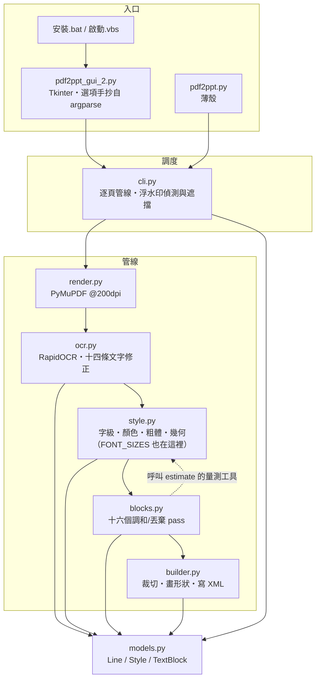

# 架構導讀：模組之間怎麼接

> ⚠️ **不知道從哪裡讀起、要動到跨模組的東西，或要新增／拆分模組之前請先讀這一份。** 十分鐘看完。
>
> **這一份只回答「模組之間怎麼接」**——依賴方向、真實呼叫順序、每個檔案裝什麼。**規則本身、門檻與反例一律不在這裡**，在 `docs/spec/`（13 章）；「規格第 N 章對到哪個檔」在 `docs/spec/12-附錄-現行實作對照.md`。
>
> ⚠️ **這一份是照程式碼現況寫的，會被改碼弄過時**（那正是它住在 `docs/dev/` 而不是 `docs/spec/` 的原因）。**不要在這裡複述規則**——複述一次就是多一份會漂的副本，這個 repo 已經吃過虧（`CJK_INK_RATIO` 漂了兩個多月；這份文件自己也曾把 `FONT_SIZES` 畫在 `models.py`，實際在 `style.py`，2026-08-24 才發現）。

## 1. 模組地圖



**依賴方向：`cli` → 管線 → `models`，不回頭。** 兩條刻意的邊，兩條都有理由：

- **`blocks` import `style`**（`_measure_em`／`snap_font_size`／`text_width_em`）：調和 pass 要重算「這個字級放不放得下」，而**寬度量測只能有一份**——`style` 是唯一知道 YaHei 度量的人。反向不成立。
- **`builder` 不 import `style`**：它只吃 `Style` 的欄位。⚠️ 這條邊正是「裁切必須寫 `Style.cover_band_px` 而不是改字墨界」的原因——`builder` 之後會把色帶重新推導一次，改字墨界等於把剛買到的間隙又還回去。

同一張 200dpi 渲染圖**同時供 OCR、樣式估計與投影片背景使用**，全程不重繪。

## 2. 真實的呼叫順序（`cli.main`）

```
render_page（PyMuPDF @200dpi）
  → OcrEngine.read（RapidOCR + 十四條文字修正）
  → estimate_style（逐行；style.py）
  → is_watermark / watermark_wipe   ← 浮水印在這裡就從 lines 拿掉
  → drop_unreproducible → drop_illegible_lines
  → merge_row_title_fragments
  → harmonize_stacked_overlap_size     ← 必須在 harmonize_font_sizes 之前
  → harmonize_font_sizes               ← 字級先調和，粗體隊列才乾淨
  → harmonize_code_block_latin
  → sync_clamped_twins
  → propagate_column_clamp → propagate_row_clamp
  → reeval_clamped_bold → harmonize_bold      （bold_mode == auto 才跑）
  → harmonize_across_dropped
  → clamp_row_neighbors
  → harmonize_chip_bg
  → lines_to_blocks → DeckBuilder.add_slide
```

`add_slide` 內部再跑 `_trim_row_overlaps` → `_trim_stacked_overlaps`，才開始畫形狀。

⚠️ **順序本身就是契約**，三條硬順序與各自的理由見 `docs/spec/02-領域模型與資料契約.md` §2.6。**那裡是正典，這裡只是實際的函式名**——兩邊不一致時以程式碼為準，並把這裡改對。

## 3. 每個模組裝什麼

**規則、門檻與反例都不在這一節。** 這裡只說「要找某件事，該打開哪個檔」。

| 模組 | 裝什麼 | 規則在哪 |
| --- | --- | --- |
| `render.py` | PyMuPDF @200dpi 渲染，一頁一張圖 | §2.1 |
| `ocr.py` | RapidOCR 呼叫，加上十四條文字修正：**模型丟掉的**（空格、表格 `\|`、行尾標點、行首圓點）、**模型讀錯的**（簡體混入、頁面詞彙校正、混淆雙字組、圖示誤認字母）、**偵測器漏掉／看錯的**（漏行救援、旋轉救援、單一字形的角度丟棄） | §3 |
| `style.py` | 逐行估一個 `Style`。四件互相糾纏的事：**字級**（字墨帶量測、逐字 CJK 共識）、**寬度夾制**（三級天花板）、**顏色**（環帶／光暈／聚類三層）、**粗體**（三段判別）。全專案最大的模組，也是字級階梯與寬度量測的家 | §4、§5、§6 |
| `blocks.py` | `estimate_style` 是**逐行**的，看不到「這兩行其實是同一段」。十六個 pass 補上這一層：丟棄、合併碎片、字級一致（八個）、粗體一致（兩個）、底色一致（一個） | §4、§5、§6、§7 |
| `builder.py` | 每個 `TextBlock` 畫成一到多個形狀；兩道裁切在畫形狀之前跑；東亞字型要自己注入 XML | §6、§8 |
| `models.py` | `Line`／`Style`／`TextBlock` 與對齊常數。**沒有邏輯** | §2 |
| `palette.py`／`paths.py` | 圖形介面的**顏色**與這台機器上的**落地位置**。兩支都**坐在 GUI 的啟動路徑上**，所以都只准 import 標準函式庫（多一個相依，「雙擊到視窗出現」就多付一次）。`paths.py` 另外是三個姊妹專案共用的底層工具，見 §4 | §9.3 |
| `cli.py` | 逐頁調度（`_convert_page` 一頁一個 try，失敗只降級那一頁）、命令列參數（正典）、浮水印偵測與遮擋 | §2.6、§7、§9.5 |

**`blocks.py` 的三個共用述詞**（值得知道，因為它們是「八份手抄收斂成一份」的結果）：`_same_surface`（同粗體／文字色／底色）、`_vert_adjacent`（垂直緊鄰）、`_union_groups`（傳遞閉包）。折行分組由 `_wrap_partition` **在任何 mutation 之前算一次**——邊算邊改會讓結果取決於走訪順序。

## 4. 共用層：哪些東西該搬出去，哪些不該

三個姊妹專案（本專案、`C:\SOURCE5\Python\MP4-2-SRT`、`C:\SOURCE5\Python\meeting-scribe`）共用色票、形狀、文件規範與一批底層工具，而它們已經漂開過。**漂開的成因不是「忘了同步」，是把兩種不同性質的東西寫在同一個檔案裡。**

### 判準：這個專案需要跟別的專案長得不一樣嗎？

| | A 類：下游**必須**改 | B 類：下游**不該**改 |
| --- | --- | --- |
| 例子 | `palette.py` 的色碼、版面尺規、`APP_ID` 與 `APP_TITLE` 的**值**、`APP_DIR_NAME` 的**值**、圖示形狀、`SKIN_SWAPS`（哪顆鈕配哪張皮） | `paths.py`、Windows API 的呼叫法（DPI、工作列的 vtable、深色標題列）、`啟動.vbs` 的骨架與守門、皮膚產生器的幾何（超橢圓取樣、九宮格、`pill()`）、皮膚三來源的載入器、**將來的 `.ini` 與 cache** |
| 每個專案應該長得 | 不一樣（那是它的身分） | 一模一樣（一模一樣才對） |
| 機制 | **複製過去，複製完就是它自己的，不同步** | **唯一真值，改一次全部拿到** |

⚠️ **`tools/make_skin.py` 是這條界線的反例**：它把色票與「要產哪幾張皮」（A 類）跟超橢圓取樣、九宮格切法、抗鋸齒（B 類）寫在同一支裡，所以只能整支複製、然後各自演化——三邊那幾百行的差距就是這樣長出來的。

### 兩包，不是一包

⚠️ **meeting-scribe 正在往 macOS／iOS 走**，所以 Windows 專用的東西不能跟跨平台的東西混在同一包：

| 包 | 內容 | 誰用得到 |
| --- | --- | --- |
| **`winkit`**（Windows 專用） | 工作列與 DPI、`.vbs` 骨架與守門、捷徑、皮膚載入器與產生器幾何 | 本專案、MP4-2-SRT、下一個 Windows 桌面程式 |
| **底層工具**（跨平台） | **`paths.py`**、執行紀錄、`.ini`、cache | 上面三個 ＋ meeting-scribe ＋ 它的 mac 版 |

**落地形式是相對路徑相依，不是 git subtree**：使用者換電腦是複製整個 `C:\SOURCE5\`（2026-08-27 確認），所以共用包放在那底下、各專案用 `[tool.uv.sources]` 指 `{ path = "../winkit", editable = true }` 就成立——複製一次全部帶走、改一次三邊拿到、debug 直接改隔壁資料夾、沒有 build step。⚠️ 代價是**相對路徑相依看不見**：哪天只把單一專案傳給別人，`uv sync` 會失敗、而錯誤訊息是 uv 的路徑錯誤，說不出「你少複製了 winkit」——那時要在 `啟動.vbs` 的守門清單加一行（守門與它的測試已經在，見下）。

### 現在的狀態：先別建 winkit

⚠️ **等第二個 B 類模組真的出現再建**（`.ini` 就會是第二個）。只有一個模組時建共用包是過早抽象，而那個成本是「之後每次改都要多繞一圈」。

已經就位的是 **`pdf2ppt/paths.py`**——底層工具那包的第一個模組，2026-08-27 從 meeting-scribe 的同名模組抄過來（它 450 筆提交、實際踩過 OneDrive 把桌面重導走與非 Windows 匯入那兩個坑）。皮膚快取的落地、桌面與「開始功能表」全部從它出發。⚠️ **本專案刻意與藍本不同的只有兩處，兩處都是 A 類**：

- `APP_DIR_NAME` ＝ `NotebookLM_Pdf2Ppt`（**不是**專案代號 `NotebookLM_OCR`，也不是視窗標題）。⚠️ 它是**落地位置**，改了等於叫使用者的快取整批失效；`APP_TITLE`（純顯示）與 `APP_ID`（工作列身分）是另外兩個概念，**字面值哪天撞在一起也不可以併成一份**（三者現在各不相同，`tests/test_paths.py` 釘著）。
- `repo_root()` 往上**一**層，不是藍本的兩層——這個 repo 沒有 `src/` 那一層（`pyproject.toml` 的 `package = false`：根目錄同時有 `pdf2ppt.py` 與 `pdf2ppt/`，做成 wheel 只會製造麻煩）。

⚠️ **不要自己跑去改另一個 repo**（`CLAUDE.md` 有這條）：「那邊改了這邊也要改」不是授權，正確做法是生一段 PROMPT 讓使用者在那個 repo 的 session 裡跑。⚠️ **跨 repo 的唯讀查證不受此限**——查「這條為什麼長這樣」一律照舊。

## 5. 其餘的指路

| 要找什麼 | 去哪 |
| --- | --- |
| 任何一條規則的門檻、實測數據、反例、否決過的路 | `docs/spec/`（13 章，`00` 有文件地圖） |
| 規格章節 ↔ 檔案／函式名的對照，以及框架地雷 | `docs/spec/12-附錄-現行實作對照.md` |
| 怎麼跑回歸、怎麼視覺驗證、收尾清掃 | `docs/dev/verification.md` |
| 相依鎖定、字型檔、cp950／PowerShell、四個入口 | `docs/dev/windows-環境與入口.md` |
| 沒有黑視窗之後錯誤往哪裡去 | `docs/dev/gui-啟動與錯誤留底.md` |
| 協作方式的沿革與災情紀錄 | `docs/dev/collaboration.md` |
| 文件該寫在哪一層 | `docs/dev/documentation.md` |
| 硬護欄與不變量索引（每次對話自動載入） | `CLAUDE.md` |
| 安裝與操作 | `README.md` |
