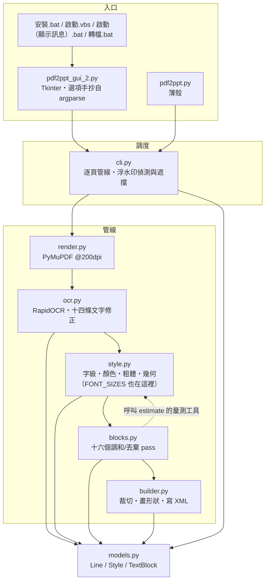

# 架構導讀：模組之間怎麼接

> ⚠️ **不知道從哪裡讀起、要動到跨模組的東西，或要新增／拆分模組之前請先讀這一份。** 十分鐘看完。
>
> **這一份只回答「模組之間怎麼接」**——依賴方向、真實呼叫順序、每個檔案裝什麼。**規則本身、門檻與反例一律不在這裡**，在 `docs/spec/`（13 章）；「規格第 N 章對到哪個檔」在 `docs/spec/12-附錄-現行實作對照.md`。
>
> ⚠️ **這一份是照程式碼現況寫的，會被改碼弄過時**（那正是它住在 `docs/dev/` 而不是 `docs/spec/` 的原因）。**不要在這裡複述規則**——複述一次就是多一份會漂的副本，這個 repo 已經吃過虧（`CJK_INK_RATIO` 漂了兩個多月；這份文件自己也曾把 `FONT_SIZES` 畫在 `models.py`，實際在 `style.py`，2026-08-24 才發現）。

## 1. 模組地圖



**依賴方向：`cli` → 管線 → `models`，不回頭。** 兩條刻意的邊，兩條都有理由：

- **`blocks` import `style`**（`_measure_em`／`snap_font_size`／`text_width_em`）：調和 pass 要重算「這個字級放不放得下」，而**寬度量測只能有一份**——`style` 是唯一知道 YaHei 度量的人。反向不成立。
- **`builder` 不 import `style`**：它只吃 `Style` 的欄位。⚠️ 這條邊正是「裁切必須寫 `Style.cover_band_px` 而不是改字墨界」的原因——`builder` 之後會把色帶重新推導一次，改字墨界等於把剛買到的間隙又還回去。

同一張 200dpi 渲染圖**同時供 OCR、樣式估計與投影片背景使用**，全程不重繪。

## 2. 真實的呼叫順序（`cli.main`）

```
render_page（PyMuPDF @200dpi）
  → OcrEngine.read（RapidOCR + 十四條文字修正）
  → estimate_style（逐行；style.py）
  → is_watermark / watermark_wipe   ← 浮水印在這裡就從 lines 拿掉
  → drop_unreproducible → drop_illegible_lines
  → merge_row_title_fragments
  → harmonize_stacked_overlap_size     ← 必須在 harmonize_font_sizes 之前
  → harmonize_font_sizes               ← 字級先調和，粗體隊列才乾淨
  → harmonize_code_block_latin
  → sync_clamped_twins
  → propagate_column_clamp → propagate_row_clamp
  → reeval_clamped_bold → harmonize_bold      （bold_mode == auto 才跑）
  → harmonize_across_dropped
  → clamp_row_neighbors
  → harmonize_chip_bg
  → lines_to_blocks → DeckBuilder.add_slide
```

`add_slide` 內部再跑 `_trim_row_overlaps` → `_trim_stacked_overlaps`，才開始畫形狀。

⚠️ **順序本身就是契約**，三條硬順序與各自的理由見 `docs/spec/02-領域模型與資料契約.md` §2.6。**那裡是正典，這裡只是實際的函式名**——兩邊不一致時以程式碼為準，並把這裡改對。

## 3. 每個模組裝什麼

**規則、門檻與反例都不在這一節。** 這裡只說「要找某件事，該打開哪個檔」。

| 模組 | 裝什麼 | 規則在哪 |
| --- | --- | --- |
| `render.py` | PyMuPDF @200dpi 渲染，一頁一張圖 | §2.1 |
| `ocr.py` | RapidOCR 呼叫，加上十四條文字修正：**模型丟掉的**（空格、表格 `\|`、行尾標點、行首圓點）、**模型讀錯的**（簡體混入、頁面詞彙校正、混淆雙字組、圖示誤認字母）、**偵測器漏掉／看錯的**（漏行救援、旋轉救援、單一字形的角度丟棄） | §3 |
| `style.py` | 逐行估一個 `Style`。四件互相糾纏的事：**字級**（字墨帶量測、逐字 CJK 共識）、**寬度夾制**（三級天花板）、**顏色**（環帶／光暈／聚類三層）、**粗體**（三段判別）。全專案最大的模組，也是字級階梯與寬度量測的家 | §4、§5、§6 |
| `blocks.py` | `estimate_style` 是**逐行**的，看不到「這兩行其實是同一段」。十六個 pass 補上這一層：丟棄、合併碎片、字級一致（八個）、粗體一致（兩個）、底色一致（一個） | §4、§5、§6、§7 |
| `builder.py` | 每個 `TextBlock` 畫成一到多個形狀；兩道裁切在畫形狀之前跑；東亞字型要自己注入 XML | §6、§8 |
| `models.py` | `Line`／`Style`／`TextBlock` 與對齊常數。**沒有邏輯** | §2 |
| `cli.py` | 逐頁調度、命令列參數（正典）、浮水印偵測與遮擋 | §2.6、§7 |

**`blocks.py` 的三個共用述詞**（值得知道，因為它們是「八份手抄收斂成一份」的結果）：`_same_surface`（同粗體／文字色／底色）、`_vert_adjacent`（垂直緊鄰）、`_union_groups`（傳遞閉包）。折行分組由 `_wrap_partition` **在任何 mutation 之前算一次**——邊算邊改會讓結果取決於走訪順序。

## 4. 其餘的指路

| 要找什麼 | 去哪 |
| --- | --- |
| 任何一條規則的門檻、實測數據、反例、否決過的路 | `docs/spec/`（13 章，`00` 有文件地圖） |
| 規格章節 ↔ 檔案／函式名的對照，以及框架地雷 | `docs/spec/12-附錄-現行實作對照.md` |
| 怎麼跑回歸、怎麼視覺驗證、收尾清掃 | `docs/dev/verification.md` |
| 相依鎖定、字型檔、cp950／PowerShell、四個入口 | `docs/dev/windows-環境與入口.md` |
| 沒有黑視窗之後錯誤往哪裡去 | `docs/dev/gui-啟動與錯誤留底.md` |
| 協作方式的沿革與災情紀錄 | `docs/dev/collaboration.md` |
| 文件該寫在哪一層 | `docs/dev/documentation.md` |
| 硬護欄與不變量索引（每次對話自動載入） | `CLAUDE.md` |
| 安裝與操作 | `README.md` |
