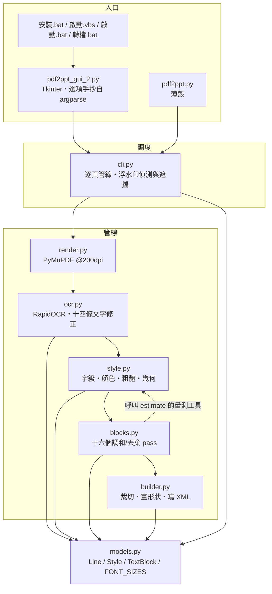

# NotebookLM_OCR 系統規格（架構導讀）

> 對象：維護／開發者。使用手冊在 `README.md`。本文件依**程式碼現況**整理，負責「模組之間」的關係；**每一條規則的完整理由、門檻與反例在 `docs/spec/`（12 章）**，本文是它的十分鐘版。
>
> ⚠️ **常數的正典是程式碼**。本文與 `CLAUDE.md`、`docs/spec/` 都是整理版，出現分歧以程式碼為準（`tests/test_docs.py` 釘著三方一致）。

## 1. 系統定位

把純影像的 NotebookLM 簡報 PDF 變成可以在 PowerPoint 裡直接編輯的 `.pptx`：每一頁以全解析度渲染圖當背景，疊上實心填色矩形蓋住點陣文字，再放上可編輯、樣式比對過的文字。

**字級、粗體、文字色、蓋板色全部從影像估計**——來源 PDF 沒有文字層，那正是這個專案存在的理由。

硬性原則：

| 原則 | 落實方式 |
| --- | --- |
| **所有調整必須具通用性** | 嚴禁針對單一頁面／單一字串硬編碼。每條規則都要有可一般化的成因與判別準則，並記錄反例。唯一例外是無誤殺空間的辭典型修正（`_CONFUSION_BIGRAMS`） |
| **偵測框不可信** | RapidOCR 的框留白不一致。字級由**字墨帶**量、浮水印遮擋由**掃描**量、蓋板由**字墨界**推——沒有一處拿框高的倍數去猜 |
| **同家族寧可一致也不要混雜** | 使用者裁定（2026-06-13）。四個 pass 實現：折行組、堆疊孿生、同欄拖動、同列多數決 |
| **轉不好就別轉** | 插圖裡的 8pt 亂碼轉成可編輯文字＝錯字蓋板，**比留原圖更糟**。`drop_unreproducible` + `drop_illegible_lines` 兩道 |
| **本地離線** | RapidOCR 本機推論，不上傳任何內容。唯一連網行為是首次下載 ONNX 模型 |

技術棧：Python 3.14（uv）／ PyMuPDF（渲染）／ RapidOCR PP-OCRv5 + **server** 辨識模型（繁中準確度遠勝預設 v4 mobile）／ ONNX Runtime DirectML ／ python-pptx ／ OpenCC ／ Pillow（量字寬）。

## 2. 模組地圖



依賴方向：`cli` → 管線 → `models`，不回頭。兩條刻意的邊：

- **`blocks` import `style`**（`_measure_em`／`snap_font_size`／`text_width_em`）：調和 pass 要重算「這個字級放不放得下」，而寬度量測只能有一份——`style` 是唯一知道 YaHei 度量的人。反向不成立。
- **`builder` 不 import `style`**：它只吃 `Style` 的欄位。⚠️ 這條邊是**裁切必須寫 `Style.cover_band_px` 而不是改字墨界**的原因——builder 之後會把色帶重新推導一次，改字墨界等於把剛買到的間隙又還回去。

同一張 200dpi 渲染圖**同時供 OCR、樣式估計與投影片背景使用**，全程不重繪。

## 3. 逐頁管線（`cli.main`）

```
render_page（PyMuPDF @200dpi）
  → OcrEngine.read（RapidOCR + 十四條文字修正）
  → estimate_style（逐行；style.py）
  → is_watermark / watermark_wipe   ← 浮水印在這裡就從 lines 拿掉
  → drop_unreproducible → drop_illegible_lines
  → merge_row_title_fragments
  → harmonize_stacked_overlap_size     ← 必須在 harmonize_font_sizes 之前
  → harmonize_font_sizes               ← 字級先調和，粗體隊列才乾淨
  → harmonize_code_block_latin
  → sync_clamped_twins
  → propagate_column_clamp → propagate_row_clamp
  → reeval_clamped_bold → harmonize_bold      （bold_mode == auto 才跑）
  → harmonize_across_dropped
  → clamp_row_neighbors
  → harmonize_chip_bg
  → lines_to_blocks → DeckBuilder.add_slide
```

⚠️ **順序本身就是契約**，至少三處：
1. `harmonize_stacked_overlap_size` 在 `harmonize_font_sizes` **之前**——否則調和會把已修正的字級重新併回去。
2. 粗體投票在字級調和**之後**——隊列鍵是「同頁同字級」，字級沒調和好隊列就是髒的。
3. 三個 clamp 傳播 pass 的先後（欄 → 列）決定誰拖得動誰。

`add_slide` 內部再跑 `_trim_row_overlaps` → `_trim_stacked_overlaps`，才開始畫形狀。

## 4. 核心流程一：OCR 與文字修正（`ocr.py`）

RapidOCR 回傳的原文**不能直接用**，十四條修正把它變成可用的文字。分三類：

| 類別 | 做什麼 | 代表 |
| --- | --- | --- |
| **模型丟掉的東西** | 空格（CTC word box + 物理檢查）、表格 `\|`（六道閘門）、行尾標點（rec-only 重讀 + 兩道防幻覺）、行首圓點（三道形狀判別） | `_restore_latin_gaps`、`_restore_pipes`、`_restore_leading_bullet` |
| **模型讀錯的東西** | 簡體混入（**s2tw 不是 s2t**，且只套繁簡混雜的行）、頁面詞彙校正、混淆雙字組、⚠ 讀成 A、實心圖示讀成字母 | `_fix_simplified_strays`、`_vocab_correct`、`_looks_like_filled_icon` |
| **偵測器漏掉／看錯的東西** | 同籌片漏行救援、旋轉救援（±3/6/9° 暴力重讀）、**單一字形的角度一律丟棄**（沒有基線就沒有方向） | `_rescue_sibling_bands`、`_tilt_has_baseline` |

⚠️ 貫穿全部的一條契約：**任何破壞「字元 1:1 對應」的轉換都必須把 `Line.char_boxes` 設成 `None`**——逐字顏色、上標偵測、pipe 復原全靠它，留著錯的比沒有更糟。

⚠️ RapidOCR 的 `use_det/use_cls/use_rec` 會**跨呼叫殘留**：每次呼叫都必須三個旗標全部顯式傳入。

詳見 `docs/spec/03`。

## 5. 核心流程二：樣式估計（`style.py`，全專案最大的模組）

`estimate_style()` 對每一行回傳一個 `Style`。四件事互相糾纏：

**字級**——量框內緊貼字形墨水的高度，除以 `CJK_INK_RATIO`。難點全在「哪些墨水算數」：字墨列要分群取最重的群（跨進框內的鄰行墨水、行首圖示、被 cap 剔除的密集粗體列各有處置），混排行還要取**逐字 CJK 共識**（拉丁降部會伸到表意字帶底下、灌高整行）。

**寬度夾制**——YaHei 比來源字型寬，長行放不下就要降級。三級天花板：投影片右緣（硬，進 `max_fit_pt`）、障礙（近硬，進 `clamp_pt`，⚠️ **不可**進 `max_fit_pt`）、字墨寬（軟，有懸崖防護）。

**顏色**——環帶取樣會以兩種方式失敗（灰帶間的白條、框溢出膠囊），所以有光暈修正、k=3 聚類重推、筆畫核心取樣三層。⚠️ 光暈取樣必須**往外走到顏色穩定才承認那是表面**（`_surface_around_ink`）——這類簡報的文字帶 10–20px 柔和暗影，只取一圈會整圈落在投影裡。走了幾段就是投影半徑，存成 `Style.glow_px` 給蓋板用。

**粗體**——≥24pt 一律粗、≥16pt 用模板比對（YaHei Regular/Bold 各渲染一次比筆畫寬）、更小用筆畫門檻。有彩深色文字退回筆畫規則，但只覆蓋模板的邊際帶。

詳見 `docs/spec/04`（字級）、`05`（粗體）、`06`（顏色）。

## 6. 核心流程三：調和與丟棄（`blocks.py`）

`estimate_style` 是**逐行**的，看不到「這兩行其實是同一段」。十六個 pass 補上這一層：

| 群 | pass | 解決什麼 |
| --- | --- | --- |
| **丟棄** | `drop_unreproducible`、`drop_illegible_lines` | 轉了會更糟的行整行留原圖 |
| **合併** | `merge_row_title_fragments` | 被偵測器打散的標題碎片（⚠️ 但**不可跨越表格欄線**） |
| **字級一致** | `harmonize_font_sizes`（折行組）、`harmonize_stacked_overlap_size`（同卡堆疊）、`sync_clamped_twins`、`propagate_column_clamp`、`propagate_row_clamp`、`clamp_row_neighbors`、`harmonize_code_block_latin`、`harmonize_across_dropped` | 同段／同卡／同欄／同列的字級散階 |
| **粗體一致** | `reeval_clamped_bold`、`harmonize_bold` | 判別器在門檻附近擲硬幣 |
| **底色一致** | `harmonize_chip_bg` | 同晶片上逐行 bg 漂移畫出色差接縫 |

三個共用述詞讓這些 pass 不再各自手抄：`_same_surface`（同粗體／文字色／底色）、`_vert_adjacent`（垂直緊鄰）、`_union_groups`（傳遞閉包）。折行分組由 `_wrap_partition` **在任何 mutation 之前算一次**——邊算邊改會讓結果取決於走訪順序。

⚠️ 家族拖動必須是**多數決**（`propagate_row_clamp`）：一次誤夾若能拖動全家，就會放大成一整列錯誤。

詳見 `docs/spec/04`、`07`。

## 7. 核心流程四：輸出（`builder.py`）

每個 `TextBlock` 畫成一到多個形狀。三件容易誤解的事：

**形狀同時是蓋板與文字容器**——蓋板必須涵蓋整個點陣字墨，文字字形必須落在點陣字墨上，小字時兩者衝突。解法是用 `margin_top` 內距解耦，**絕不移動形狀頂端**。

**`--cover` / `--no-cover` 只決定「色塊畫在哪」**，不是精緻度開關。**預設 `--no-cover`**（2026-08-24 起）：底色長在文字方塊上（在 PowerPoint 裡移動文字時底色跟著走），色帶因此比字墨高 0.20em（PowerPoint 的行首 leading 補償）——⚠️ 裁切必須知道這件事，而分段蓋板、弧形切線段、同列/堆疊裁切**兩種模式都要做**。兩者的視覺輸出是平手（十五頁逐像素比對，最大 0.22%），預設換邊換的是可維護性：形狀數 255 vs 463，且 227 行行為一致（`--cover` 下仍有 19 行自帶填色）。理由與量測見 `docs/spec/06`。

**兩道裁切在畫形狀之前跑**：`_trim_row_overlaps`（同列框外擴壓進鄰行，⚠️ 嵌套框整對跳過、邊界鉗回兩框之內，否則寫出負寬度、PowerPoint 判檔案損毀）與 `_trim_stacked_overlaps`（上下堆疊，既處理重疊也**填補同色蓋板之間的縫**——那條縫正是上一行投影的尾巴）。

**CJK 字型需要直接寫 XML**：python-pptx 的 `font.name` 只設 `<a:latin>`，必須用 `_set_east_asian_font()` 注入 `<a:ea>`，否則中文會悄悄回落到佈景主題字型。

詳見 `docs/spec/08`。

## 8. 邊角情況（各自有完整章節）

弧形緞帶文字（3–6 段切線文字方塊 + 12 條沿弧條帶）、直排 CJK（`vert="eaVert"`）、旋轉文字的兩種來源、雙色橫幅與行內 highlight 的分段蓋板、上標註腳、刪除線、浮水印遮擋（⚠️ 從浮水印往外走、遇空白就停，不是取視窗內最外側的墨）。

詳見 `docs/spec/06`、`07`。

## 9. 驗證

沒有轉換品質的自動化測試——真值是「跟原稿長得一不一樣」。實際做法三層：

1. **`uv run pytest`**（`tests/test_docs.py`）：守文件與程式碼的一致性（常數值、指路、CLI 旗標三方一致、spec 目錄與地圖雙向）。上線第一次執行就抓到兩處已經漂了兩個多月的漂移。
2. **四份 deck 全跑、`--debug` JSON 逐行對照**：這是唯一有效的回歸手段，**預期零差異**。目視絕對看不出來的回歸都是這樣抓到的。
3. **PowerPoint COM 匯出 PNG 與渲染圖並排目視**：樣式的唯一真值。

⚠️ **不要用參考 PPTX 校準樣式**——它的樣式旗標是從我們自己更早的輸出繼承來的。

詳見 `docs/spec/10`。

## 10. 專案慣例

- 回覆與 git commit 訊息一律**繁體中文**（台灣用語）；commit 訊息**避免雙引號**（PowerShell 5.1 會截斷），結尾加 `Co-Authored-By`。
- **修正完成並驗證後自動 commit + push**；使用者看得到的行為變了就同一輪更新 `README.md`。
- **「記住」＝寫進 repo**，不是寫進 Claude Code 的記憶目錄（那個目錄在 repo 之外、換電腦帶不走，已於 2026-08-17 退役）。
- 臨時檔一律寫到 scratchpad，不要落在專案裡；每輪最後跑一次完整清掃並 `ls -1` 目視——**乾淨的 `git status` 不等於乾淨的工作目錄**（`.gitignore` 會把殘留藏起來，這條失守過兩次）。

完整的協作規則與沿革在 `CLAUDE.md` 的「協作方式」章與 `docs/dev/collaboration.md`。
